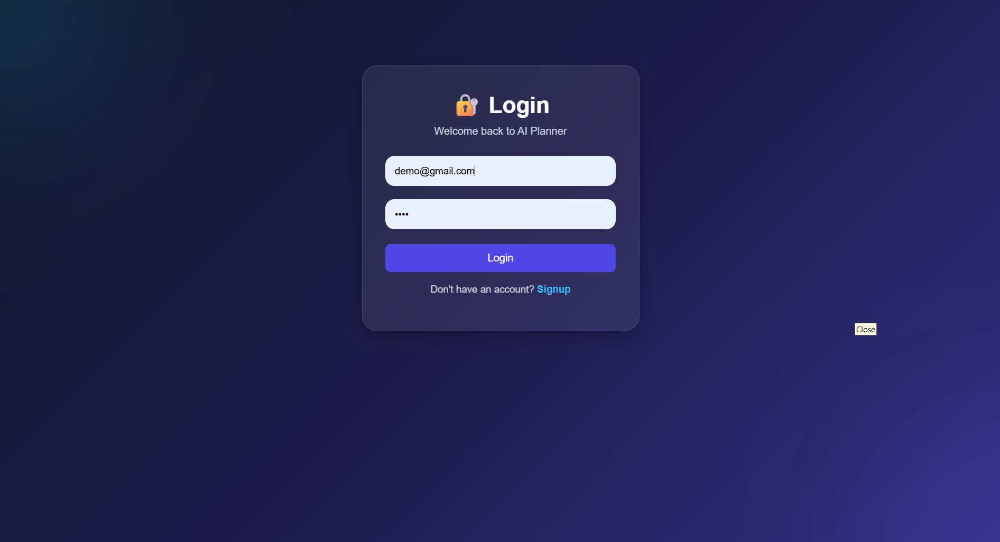
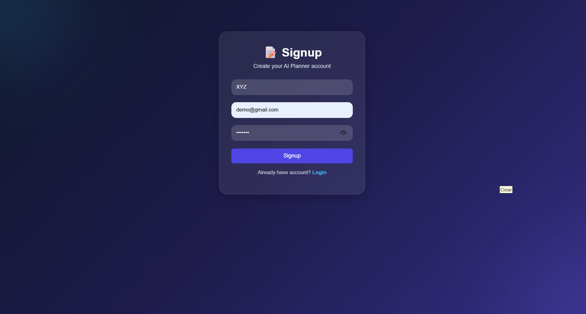
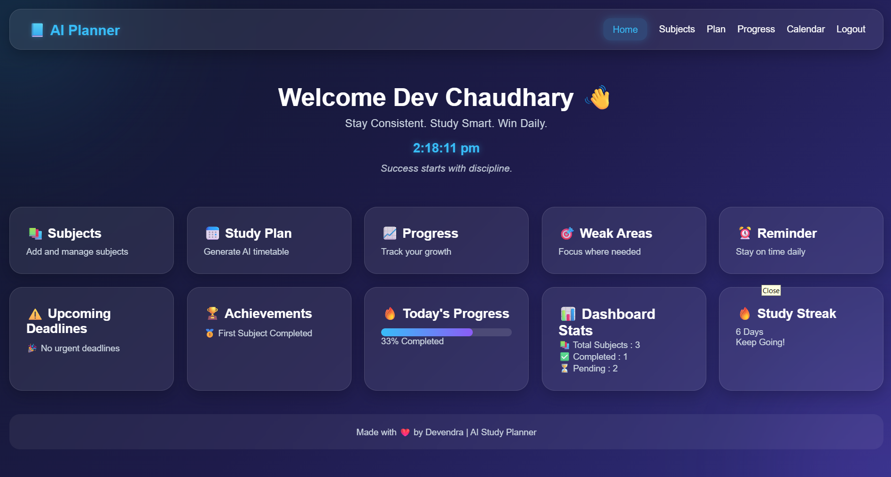
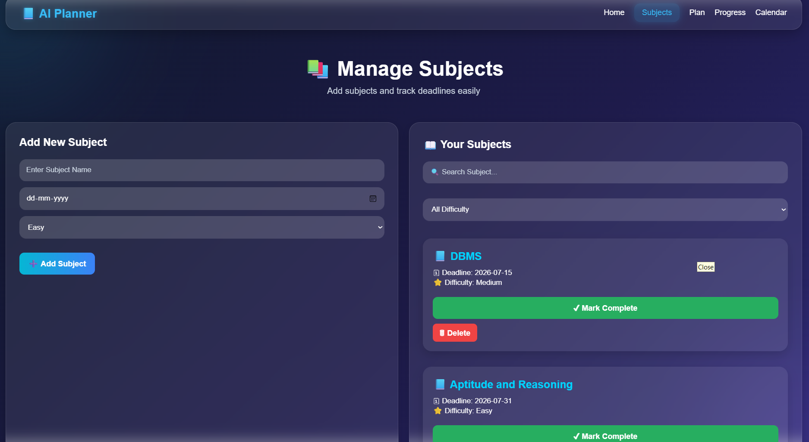
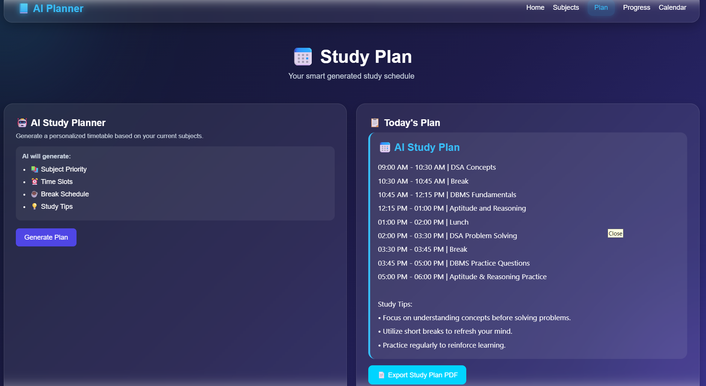
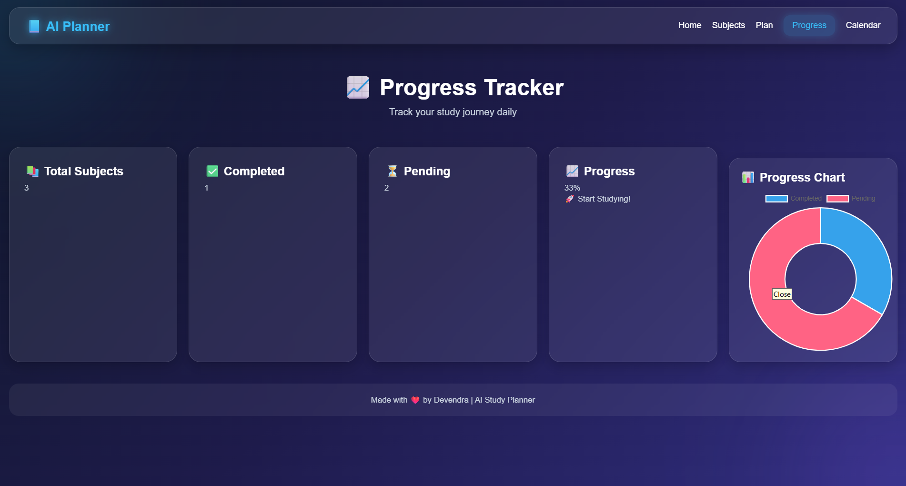
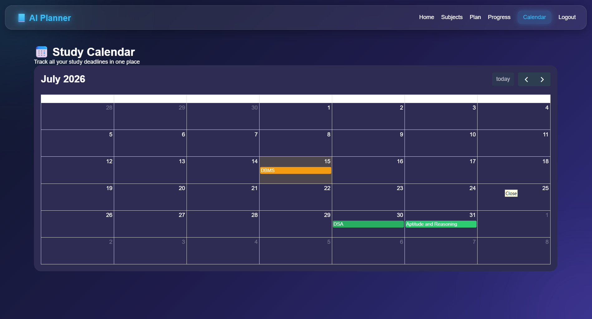

# 📚 AI Study Planner

An AI-powered Study Planner that helps students organize subjects, generate personalized study plans using Google Gemini AI, and track their learning progress.

---

## 🚀 Features

- 🔐 User Authentication (Signup & Login)
- 🔑 JWT Authentication
- 📚 Add & Delete Subjects
- ✅ Mark Subjects as Completed
- 📊 Progress Tracking Dashboard
- 🤖 AI Study Plan Generation using Google Gemini AI
- 📅 Deadline Management
- 🎯 Difficulty-based Subject Organization
- 💾 MongoDB Database Integration

---

# 📸 Project Screenshots

## 🔐 Login Page



---

## 📝 Signup Page



---

## 🏠 Dashboard



---

## 📚 Subject Management



---

## 🤖 AI Study Plan



---

## 📈 Progress Tracker



---

## 📅 Study Calendar



---

---

## 🛠️ Tech Stack

### Frontend
- HTML5
- CSS3
- JavaScript

### Backend
- Node.js
- Express.js

### Database
- MongoDB Atlas
- Mongoose

### Authentication
- JWT (JSON Web Token)
- bcrypt.js

### AI Integration
- Google Gemini API

---

## 📂 Project Structure

AI-Study-Planner/
│
├── backend/
│ ├── server.js
│ ├── user.js
│ ├── subject.js
│ ├── package.json
│ └── .gitignore
│
├── frontend/
│ ├── index.html
│ ├── login.html
│ ├── signup.html
│ ├── subjects.html
│ ├── progress.html
│ ├── reminder.html
│ ├── schedule.html
│ ├── calendar.html
│ ├── app.js
│ ├── auth.js
│ ├── calendar.js
│ └── style.css
│
└── README.md

---

## ⚙️ Installation

### Clone Repository

```bash
git clone https://github.com/devendrakumar9918/AI-Study-Planner.git
```

### Go to Backend

```bash
cd AI-Study-Planner/backend
```

### Install Dependencies

```bash
npm install
```

### Create .env

```env
MONGODB_URI=your_mongodb_connection_string

JWT_SECRET=your_secret_key

GEMINI_API_KEY=your_gemini_api_key
```

### Start Server

```bash
node server.js
```

Open frontend/index.html using Live Server.

---

## 🔑 Environment Variables

| Variable | Description |
|----------|-------------|
| MONGODB_URI | MongoDB Atlas Connection String |
| JWT_SECRET | JWT Secret Key |
| GEMINI_API_KEY | Google Gemini API Key |

---

## 🚀 Future Improvements

- ✏️ Edit Subject
- 📱 Mobile Responsive Design
- 🌙 Dark / Light Mode
- 📧 Email Reminder
- 📄 Export Study Plan as PDF
- ☁️ Cloud Deployment

---

## 👨‍💻 Author

**Devendra Kumar**

GitHub:
https://github.com/devendrakumar9918